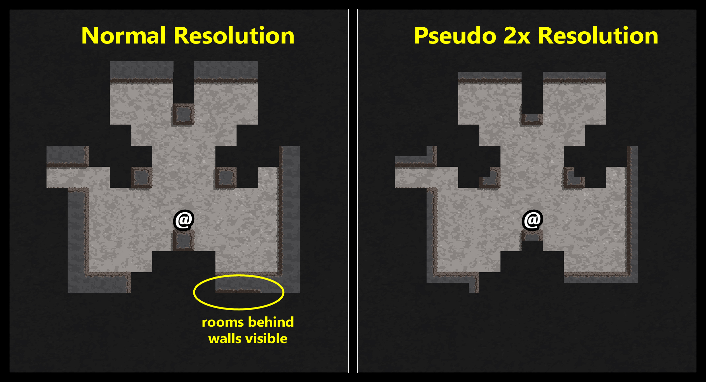
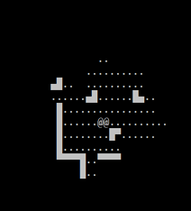
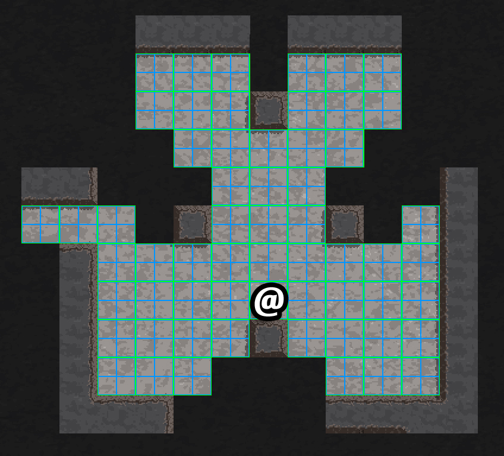
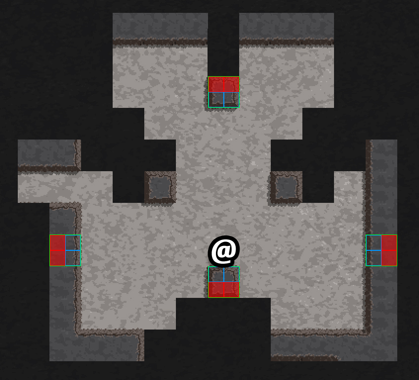
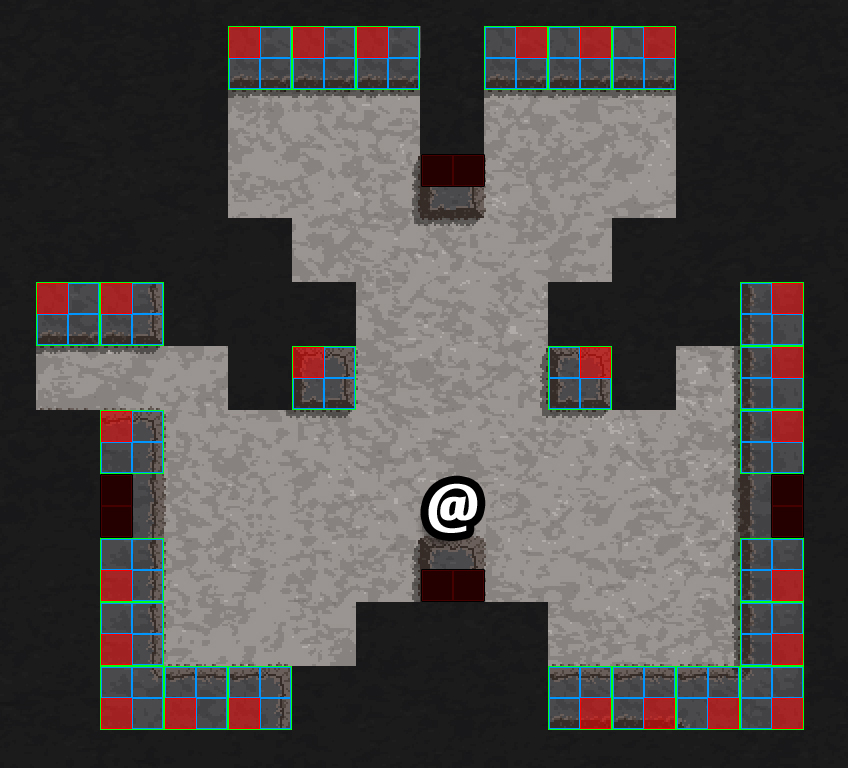
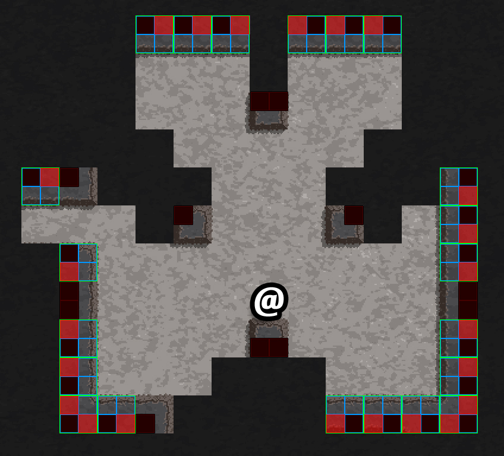
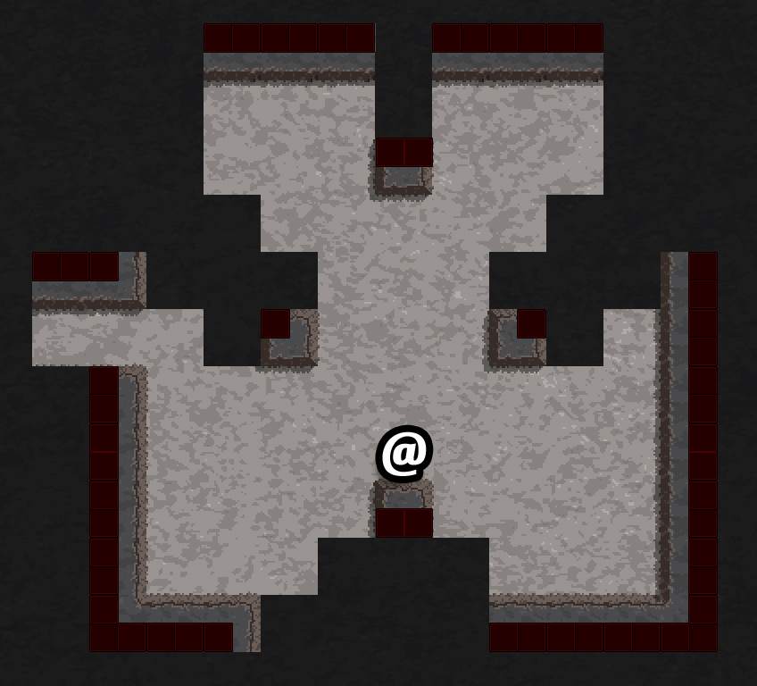

# Pseudo 2x resolution FOV using recursive shadowcasting

A tweak built upon [Andy Stobirski's FOVRecurse C# implementation](https://github.com/AndyStobirski/RogueLike) (no license) to allow toggleable-visibility sub-tiles.

## What's this

This is a tweak for a specific scenario built on top of this FOV algorithm:

- [Computing LOS for Large Areas (RogueBasin)](http://roguebasin.roguelikedevelopment.org/index.php?title=Computing_LOS_for_Large_Areas) by Gordon Lipford
- [FOV using recursive shadowcasting (RogueBasin)](http://roguebasin.roguelikedevelopment.org/index.php?title=FOV_using_recursive_shadowcasting) by Björn Bergström
- [FOV using recursive shadowcasting - improved (RogueBasin)](http://roguebasin.roguelikedevelopment.org/index.php?title=FOV_using_recursive_shadowcasting_-_improved) by Henri Hakl 
- [Field of Vision using recursive shadow casting: C# .Net 3.5 implementation (Evil Science)](http://www.evilscience.co.uk/field-of-vision-using-recursive-shadow-casting-c-3-5-implementation/) by Andy Stobirski

It divides each tile into 4 sub-tiles and shows only those visible without running a 2x-resolution FOV, allowing solid tiles to be visible only from one side. A picture is worth a thousand words:



The motivation behind it is that I wanted to avoid the blocks with walls in opposite sides to reveal hidden rooms. There are other ways to handle that, this is just the first one that I liked when I tried it.

## How it looks

Note: tiles are 2 characters wide \


## Other approachs

From a [reddit comment](https://www.reddit.com/r/roguelikedev/comments/er3nr1/pseudo_2x_resolution_fov_using_recursive/ff1cb54/) by [aotdev (Age of Transcendence)](https://www.reddit.com/user/aotdev):

> I tackled this problem at the presentation level, implementing a custom fog-of-war shader. [Here is a video that shows it](https://www.youtube.com/watch?v=AlqCzoffPp8). Instead of running FoV in the subcells, I just reveal the subcells that are adjacent to a visible cell. It's super simple and no hacks are needed.

## Implementation

For a map of NxM (main-)tiles we run the algorithm as explained in the RogueBasin articles with the only difference of, when setting the visibility of a main-tile (in NxM coordinates) we calculate 4 visibilities, one for each sub-tile (in 2*N x 2*M coordinates):

- If it's an **empty main-tile**: we set all the sub-tiles as visible \
  

- If it's a **blocking main-tile**:
  - We **check if we are in the same row or column**:
    - **Yes** (we are "directly in front" of the main-tile) we set the 2 sub-tiles in the back as not-visible. \
      

    - **No** (we are seeing the block in an angle) we set the opposite sub-tile as not-visible. \
      

  - We **check if there is another wall blocking the visible sides of the tile**. If there is a blocking main-tile, we set the blocked back sub-tile as not-visible. \
      

Final result:



When finished, for every tile in NxM coordinates there will be 4 sub-tiles in 2*N x 2*M coordinates. \
E.g.:

```text
main-tile: (x=13, y= 7)
sub-tiles: (x=26, y=14) (x=27, y=14)
           (x=26, y=15) (x=27, y=15)
```

## Nuances

It's called *pseudo* 2x resolution because it's not exactly the same as running the original algorithm on a 2x map. The most obvious thing is that the character would fill 4 tiles and you will need to choose one as the player position, or tweak the algorithm to calculate the visibility from a point inbetween 4 tiles instead of from the center of one.

Also, there are some *corner* cases in which a sub-tile would be visible with a 2x resolution FOV but not with the pseudo-2x one because in the pseudo-2x we only calculate the visibility of the sub-tiles if the main-tile is visible, while in the real-2x we calculate the visibility of all the sub-tiles independently.

Regarding the visibility through touching-corners like this one:

```text
####....
####....
####.@..
####....
   .####
 .. ####
... ####
..  ####
```

I've found an ugly hack to disable them (see [branch hack-to-block-diagonals](https://github.com/Crul/FOVRecurse-Pseudo-2x-Resolution/tree/hack-to-block-diagonals)). I'm sure there are better ways to do it. I haven't put too much time in that because I like how it works when you can see through corners like that one.
